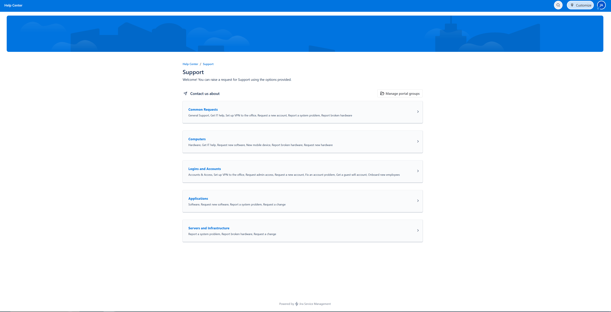
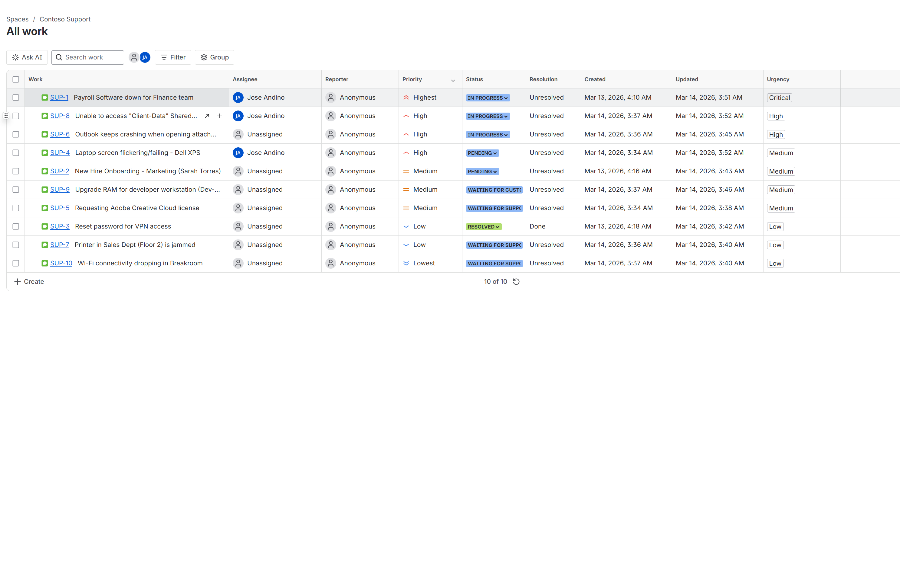
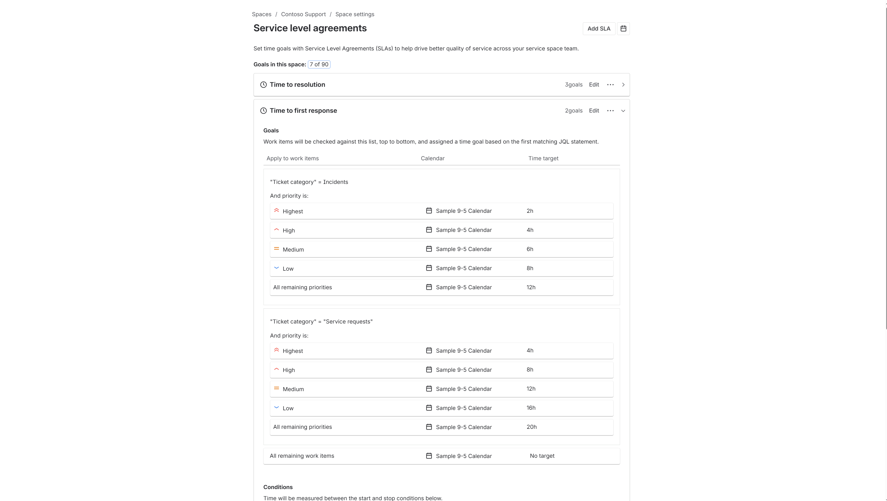
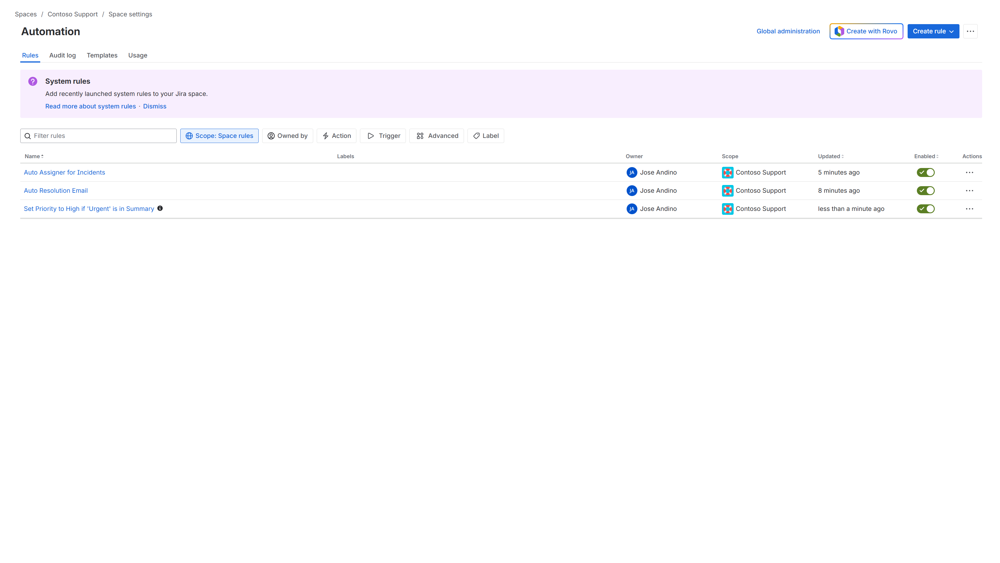

# Enterprise-Service-Desk-Implementation-with-Jira
This project demonstrates the setup and management of a professional IT Service Desk using **Jira Service Management**. The goal was to build a scalable system to handle internal IT requests, enforce SLAs, and empower users through a self-service Knowledge Base.

## 🛠️ Core Configurations
### 1. Customer Service Portal

I designed a user-centric portal with categorized request types (Hardware, Software, Access) to ensure clean data intake from the start.
* **Key Feature:** Customized field requirements to reduce "ticket ping-pong."

### 2. SLA & Queue Management

To ensure business accountability, I implemented Service Level Agreements (SLAs) based on industry standards.
* **Response Goal:** 4 Hours.
* **Resolution Goal:** 24 Hours.
* **Logic:** Timers automatically pause when a ticket is moved to "Waiting for Customer."

### 3. Automation Logic

I developed several automation rules to increase departmental efficiency.

## 📝 Documented SOPs
Included in this project are standardized procedures for:
* **VPN Password Resets** (Identity verification focused)
* **Network Drive Mapping** (GPO and Manual methods)

## 🚀 Key Learning: Challenges Overcome
**Problem:** Knowledge Base articles were not appearing for external portal customers.
**Solution:** Identified a permission mismatch between Confluence Space access and Jira Project permissions. Resolved by adjusting the 'Customer Access' settings to allow 'Unlicensed Access' to the documentation space.
